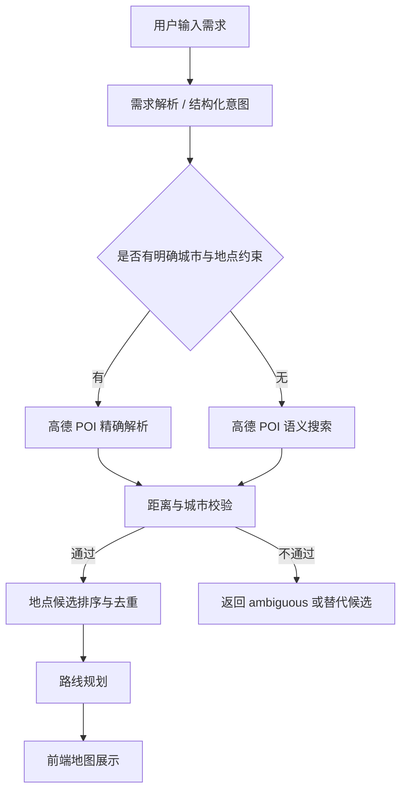
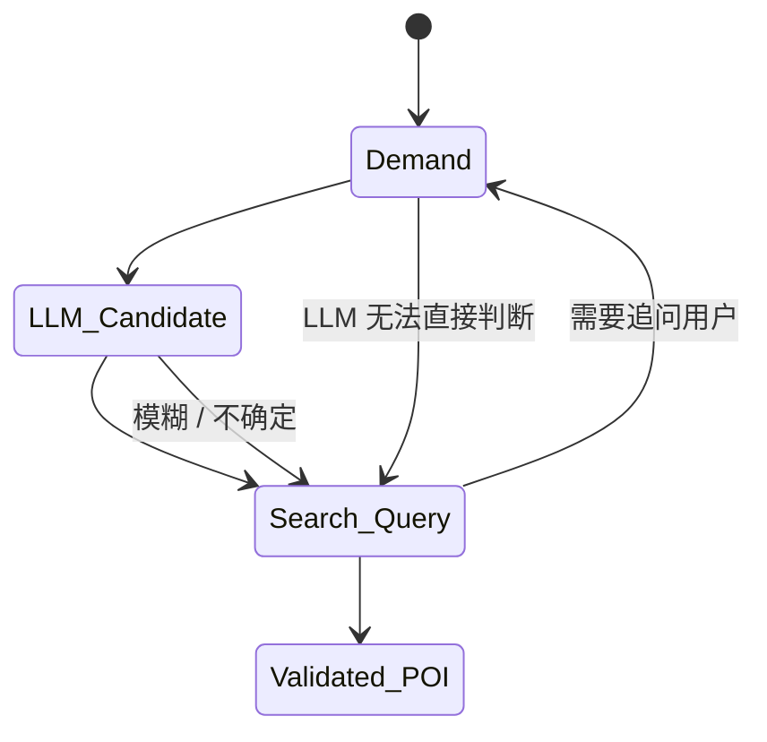

# 高德地点解析与路线规划接口设计

## 1. 目标

本设计的目标是把大模型输出从“模糊地点”收敛为“可在高德地图上验证的具体 POI”，并进一步支持：

- 地点准确落点与地图展示
- 按用户需求搜索附近可用地点
- 距离约束过滤，避免推荐过远地点
- 生成可执行路线
- 为前端提供统一的地点与路线数据结构

核心原则：

1. 大模型只负责语义理解与候选生成，不直接作为坐标来源。
2. 高德地图 POI / 地理编码是唯一的地理真值来源。
3. 只有通过验证的地点才能进入路线规划。
4. 模糊表达必须降级处理，不能硬编具体坐标。

---

## 2. 当前代码现状

仓库里已经有相关骨架，但还没有完整接通：

- 后端地图配置入口：`fastapi/core.py`
- 路由入口：`fastapi/routes.py`
- POI 服务占位：`fastapi/services/poi_service.py`
- 路线服务占位：`fastapi/services/route_service.py`
- 前端地图展示：`fastapi/static/js/app.js`
- 轻量地图工具：`fastapi/static/js/map.js`

当前 `map_config()` 仍返回 `enabled: False`，`preview_web_context()` 也未实现，因此本设计按“新增接口 + 统一数据结构 + 前后端联动”来落地。

---

## 3. 总体流程



---

## 4. 数据结构规范

### 4.1 地点对象 `Place`

所有进入后续流程的地点，建议统一成以下结构：

```json
{
  "poi_id": "string",
  "name": "string",
  "category": "string",
  "address": "string",
  "location": {
    "lng": 104.67,
    "lat": 31.46
  },
  "city": "绵阳",
  "source": "amap_poi",
  "confidence": 0.95,
  "distance_meters": 1200,
  "is_valid": true
}
```

### 4.2 需求对象 `Requirement`

```json
{
  "city": "绵阳",
  "theme": "游玩",
  "trip_style": "轻松",
  "must_have": ["吃", "逛", "拍照"],
  "avoid": ["太远"],
  "anchor_location": {
    "lng": 104.67,
    "lat": 31.46
  },
  "radius_meters": 5000
}
```

### 4.3 统一响应状态

建议统一使用：

- `ok`
- `resolved`
- `ambiguous`
- `invalid`
- `failed`

---

## 5. 接口清单

### 5.1 需求解析

作用：

- 将用户自然语言转成结构化意图
- 提取城市、主题、偏好、时间预算、位置约束
- 不直接输出最终地点列表

`POST /api/planner/requirement/interpret`

请求：

```json
{
  "session_id": "sess_xxx",
  "message": "我想去绵阳游玩，想要轻松一点，最好有吃有逛有拍照点",
  "context": {
    "current_city": "绵阳",
    "anchor_location": {
      "lng": 104.67,
      "lat": 31.46
    }
  }
}
```

响应：

```json
{
  "status": "ok",
  "intent": {
    "city": "绵阳",
    "theme": "游玩",
    "trip_style": "轻松",
    "must_have": ["吃", "逛", "拍照"],
    "avoid": [],
    "time_budget": "half_day",
    "radius_meters": 5000
  }
}
```

---

### 5.2 候选地点生成

作用：

- 让大模型先给出“可落地候选”
- 候选必须是具体地点名称，不能只是“适合拍照的地方”

`POST /api/planner/place-candidates`

请求：

```json
{
  "city": "绵阳",
  "theme": "游玩",
  "intent": {
    "trip_style": "轻松",
    "must_have": ["吃", "逛", "拍照"]
  },
  "anchor_location": {
    "lng": 104.67,
    "lat": 31.46
  }
}
```

响应：

```json
{
  "status": "ok",
  "candidates": [
    {
      "name": "人民公园",
      "category": "park",
      "reason": "市区内，适合轻松游览",
      "source_type": "llm_candidate"
    }
  ]
}
```

说明：

- 这一层只是候选生成
- 候选仍然要进入高德验证

---

### 5.3 POI 精确解析

作用：

- 把候选地点映射成高德 POI
- 如果地点可唯一确定，返回 `resolved`
- 如果不唯一或查不到，返回 `ambiguous`

`POST /api/map/poi/resolve`

请求：

```json
{
  "city": "绵阳",
  "keyword": "人民公园",
  "category_hint": "park",
  "anchor_location": {
    "lng": 104.67,
    "lat": 31.46
  }
}
```

响应：

```json
{
  "status": "resolved",
  "poi": {
    "poi_id": "B0FFF12345",
    "name": "绵阳人民公园",
    "address": "四川省绵阳市涪城区...",
    "location": {
      "lng": 104.7,
      "lat": 31.46
    },
    "category": "park",
    "distance_meters": 1200,
    "source": "amap_poi",
    "confidence": 0.95
  }
}
```

`ambiguous` 示例：

```json
{
  "status": "ambiguous",
  "reason": "no exact poi match",
  "alternatives": [
    {
      "poi_id": "B0AAA222",
      "name": "人民公园西门",
      "location": {
        "lng": 104.71,
        "lat": 31.45
      }
    }
  ]
}
```

---

### 5.4 POI 语义搜索

作用：

- 用于“我想喝咖啡”“找个吃饭的地方”“找拍照点”这类模糊需求
- 返回附近可用 POI 列表

`POST /api/map/poi/search`

#### 5.4.1 搜索模式

建议这个接口统一使用，但通过 `search_mode` 区分两种检索方式：

- `nearby`：附近搜索，围绕锚点位置找 POI
- `region`：区域搜索，在城市 / 区县 / 商圈范围内找 POI

这样可以保证接口统一，内部逻辑清晰。

请求：

```json
{
  "search_mode": "nearby",
  "city": "绵阳",
  "keyword": "咖啡店",
  "category": "food",
  "anchor_location": {
    "lng": 104.67,
    "lat": 31.46
  },
  "radius_meters": 3000,
  "limit": 10
}
```

#### 5.4.2 附近搜索 `nearby`

适合场景：

- 我想喝咖啡
- 我想吃点东西
- 我想找个休息点
- 用户已经给了当前位置、酒店位置或行程锚点

请求特征：

- 必须有 `anchor_location`
- 必须有 `radius_meters`
- 结果按距离优先排序
- 搜到后可直接进入路线规划

示例：

```json
{
  "search_mode": "nearby",
  "city": "绵阳",
  "keyword": "咖啡店",
  "category": "food",
  "anchor_location": {
    "lng": 104.67,
    "lat": 31.46
  },
  "radius_meters": 3000,
  "limit": 10
}
```

#### 5.4.3 区域搜索 `region`

适合场景：

- 绵阳游玩
- 某个区县内推荐
- 某个商圈内找点
- 用户没有精确锚点，但有明确区域

请求特征：

- 依赖 `city` 或 `region_name`
- 可以不传 `anchor_location`
- 先做区域内候选收集
- 收集后再做二次验证与距离排序

示例：

```json
{
  "search_mode": "region",
  "city": "绵阳",
  "region_name": "涪城区",
  "keyword": "景点",
  "category": "attraction",
  "limit": 10
}
```

响应：

```json
{
  "status": "ok",
  "items": [
    {
      "poi_id": "B0AAAA",
      "name": "某某咖啡馆",
      "address": "四川省绵阳市...",
      "location": {
        "lng": 104.68,
        "lat": 31.47
      },
      "distance_meters": 860,
      "rating": 4.7,
      "source": "amap_poi"
    }
  ]
}
```

#### 5.4.4 自动降级规则

建议实现以下降级逻辑：

1. 优先尝试 `nearby`
2. 如果缺少锚点或附近结果过少，降级到 `region`
3. 如果 `region` 仍然搜不到，再扩大关键词或范围
4. 如果仍无法落点，返回 `need_clarification`

#### 5.4.5 不建议的方式

- 不区分附近搜索和区域搜索
- 没有锚点也强行算距离
- 把城市级推荐直接当成“附近推荐”
- 用一个模糊关键词搜索所有场景

响应：

```json
{
  "status": "ok",
  "items": [
    {
      "poi_id": "B0AAAA",
      "name": "某某咖啡馆",
      "address": "四川省绵阳市...",
      "location": {
        "lng": 104.68,
        "lat": 31.47
      },
      "distance_meters": 860,
      "rating": 4.7,
      "source": "amap_poi"
    }
  ]
}
```

说明：

- 这里适合“推荐型需求”
- 先搜，再按距离、评分、类别排序

---

### 5.5 地点验证

作用：

- 校验地点是否在目标城市或距离范围内
- 校验结果用于决定是否进入路线规划

`POST /api/map/poi/validate`

请求：

```json
{
  "city": "绵阳",
  "anchor_location": {
    "lng": 104.67,
    "lat": 31.46
  },
  "places": [
    {
      "poi_id": "B0FFF12345",
      "name": "绵阳人民公园",
      "location": {
        "lng": 104.7,
        "lat": 31.46
      }
    }
  ],
  "max_distance_meters": 5000
}
```

响应：

```json
{
  "status": "ok",
  "validated_places": [
    {
      "poi_id": "B0FFF12345",
      "name": "绵阳人民公园",
      "is_valid": true,
      "distance_meters": 1200,
      "reason": "within_range"
    }
  ]
}
```

如果超出范围：

```json
{
  "status": "ok",
  "validated_places": [
    {
      "poi_id": "B0FFF12345",
      "name": "绵阳人民公园",
      "is_valid": false,
      "distance_meters": 28000,
      "reason": "too_far"
    }
  ]
}
```

---

### 5.6 路线规划

作用：

- 只对“已验证、已落点”的地点做路线规划
- 支持步行、驾车、公交等模式

`POST /api/map/route/plan`

请求：

```json
{
  "start": {
    "lng": 104.67,
    "lat": 31.46
  },
  "points": [
    {
      "poi_id": "B0FFF12345",
      "name": "绵阳人民公园",
      "location": {
        "lng": 104.7,
        "lat": 31.46
      }
    },
    {
      "poi_id": "B0AAA222",
      "name": "马家巷",
      "location": {
        "lng": 104.69,
        "lat": 31.48
      }
    }
  ],
  "mode": "walk"
}
```

响应：

```json
{
  "status": "ok",
  "route": {
    "segments": [
      {
        "from_poi_id": "start",
        "to_poi_id": "B0FFF12345",
        "distance_meters": 1200,
        "duration_minutes": 16
      }
    ],
    "total_distance_meters": 3400,
    "total_duration_minutes": 45
  }
}
```

---

### 5.7 最终行程生成

作用：

- 将已解析、已验证、已规划的地点组合成最终行程

`POST /api/planner/itinerary/generate`

请求：

```json
{
  "session_id": "sess_xxx",
  "intent": {
    "city": "绵阳",
    "theme": "游玩",
    "trip_style": "轻松"
  },
  "validated_places": [
    {
      "poi_id": "B0FFF12345",
      "name": "绵阳人民公园",
      "location": {
        "lng": 104.7,
        "lat": 31.46
      },
      "distance_meters": 1200
    }
  ],
  "anchor_location": {
    "lng": 104.67,
    "lat": 31.46
  }
}
```

响应：

```json
{
  "status": "ok",
  "itinerary": {
    "days": [
      {
        "day": 1,
        "items": [
          {
            "name": "绵阳人民公园",
            "poi_id": "B0FFF12345",
            "location": {
              "lng": 104.7,
              "lat": 31.46
            }
          }
        ]
      }
    ]
  }
}
```

---

### 5.8 地图配置

作用：

- 向前端暴露高德地图启用状态
- 提供浏览器端密钥和默认中心点

`GET /api/map/config`

建议响应：

```json
{
  "enabled": true,
  "browserKey": "xxx",
  "securityJsCode": "xxx",
  "webServiceKey": "xxx",
  "defaultCity": "绵阳",
  "defaultCenter": [104.67, 31.46]
}
```

当前仓库中该接口仍是静态占位，后续需要接入真实配置。

---

## 6. 大模型输出要求

### 6.1 必须结构化

大模型最终输出不能只是一段自然语言，建议最少返回：

```json
{
  "status": "resolved",
  "city": "绵阳",
  "theme": "游玩",
  "places": [
    {
      "name": "绵阳人民公园",
      "category": "park",
      "reason": "市区内，适合轻松游览"
    }
  ]
}
```

### 6.2 必须落地到具体地点

如果模型只能输出：

- “附近咖啡店”
- “适合拍照的地方”
- “经典景点”

就不能直接作为最终结果，必须先转成：

- `keyword=咖啡店`
- `keyword=拍照点`
- `keyword=景点`

再通过高德查询具体 POI。

### 6.3 不确定时必须返回 `ambiguous`

不能强行给出坐标，也不能把别的城市的地点混进来。

---

## 7. 距离与城市规则

### 7.1 距离约束

建议按需求类型设置默认距离：

- 咖啡 / 餐饮：1 到 3 公里
- 市区游玩：3 到 5 公里
- 半日游：5 到 10 公里
- 跨区景点：需要显式放宽

### 7.2 城市约束

如果用户请求的是“绵阳”，则：

- 候选地点优先在绵阳行政区内
- 不要把周边城市知名点混入
- 不确定是否属于目标城市的地点，不要输出

---

## 8. 前端消费约定

前端地图层至少需要以下字段：

- `poi_id`
- `name`
- `address`
- `location.lng`
- `location.lat`
- `distance_meters`
- `category`
- `is_valid`

前端展示建议：

- 左侧显示候选地点列表
- 地图显示 marker
- 点击 marker 时显示 POI 详情
- 路线段在地图上连线
- 如果地点被验证失败，标红提示原因

---

## 9. 与现有代码的对接点

建议后续实现时优先复用这些位置：

- `fastapi/core.py`
  - `map_config()`
  - `preview_web_context()`
  - 需求解析 / 行程生成主流程
- `fastapi/services/poi_service.py`
  - `parse_amap_location()`
  - `normalize_amap_poi_candidate()`
  - `search_amap_poi()`
- `fastapi/services/route_service.py`
  - `plan_amap_route()`
  - `enrich_planner_output_with_routes()`
- `fastapi/static/js/app.js`
  - 候选地点渲染
  - 地图 marker 渲染
  - 路线段渲染

---

## 10. 推荐开发顺序

1. 先实现需求解析接口，输出结构化 JSON。
2. 再实现高德 POI 搜索与 POI 解析。
3. 加入城市与距离验证。
4. 将验证后的地点接入路线规划。
5. 最后把标准化结果接入前端地图。

---

## 11. 最小可用版本定义

如果先做 MVP，建议只保留这 4 个接口：

1. `POST /api/planner/requirement/interpret`
2. `POST /api/map/poi/resolve`
3. `POST /api/map/poi/validate`
4. `POST /api/map/route/plan`

这四个接口打通后，就已经可以支持：

- 用户输入自然语言
- 模型输出候选地点
- 高德验证地点
- 地图展示和路线规划

---

## 12. 结论

这个方案的关键不是“让模型更会说”，而是“让模型输出必须经过地图验证”。

最终系统应该是：

- 语义由大模型负责
- 坐标由高德负责
- 距离由规则负责
- 路线由地图服务负责

---

## 13. 兜底策略：大模型无法判断时交给高德 POI

这是必须写进系统规则里的行为，不是可选项。

### 13.1 触发条件

当大模型出现以下情况时，直接进入高德 POI 兜底流程：

- 不能输出唯一具体地点
- 只输出模糊地点词，例如“咖啡店”“适合拍照的地方”“附近好玩的”
- 输出的地点无法确定是否属于目标城市
- 输出地点无法被地图服务验证

### 13.2 兜底流程

1. 大模型返回 `ambiguous` 或 `search_required`
2. 后端根据用户意图生成 POI 搜索词
3. 调用高德 POI 搜索
4. 按城市、距离、类别、评分过滤
5. 返回可落地候选
6. 仍然失败时，再追问用户最关键的补充信息

### 13.3 兜底返回格式

```json
{
  "status": "fallback_search",
  "reason": "llm_cannot_resolve_exact_place",
  "search_query": {
    "city": "绵阳",
    "keyword": "咖啡店",
    "radius_meters": 3000
  },
  "candidates": [
    {
      "poi_id": "B0XXXX",
      "name": "某某咖啡馆",
      "location": {
        "lng": 104.68,
        "lat": 31.47
      }
    }
  ]
}
```

---

## 14. 地点分层：需求、候选、搜索型需求、已验证 POI

建议把“地点”拆成四个层级，避免混淆。

### 14.1 用户需求 `Demand`

这是用户原始输入的语义层，不是地点。

示例：

- 我想喝咖啡
- 我想去绵阳游玩
- 想找适合拍照的地方

特点：

- 只有意图
- 可能没有明确地点
- 不能直接上地图

### 14.2 大模型候选 `LLM Candidate`

这是模型根据需求生成的候选方向，仍然不是最终地点。

示例：

- 咖啡馆
- 人民公园
- 马家巷

特点：

- 可能是具体地点名
- 也可能只是搜索方向
- 需要进一步验证

### 14.3 搜索型需求 `Search Query`

这是后端用于调用高德 POI 的查询参数。

示例：

- city = 绵阳
- keyword = 咖啡店
- radius_meters = 3000
- category = food

特点：

- 面向搜索引擎
- 用于从语义转成可检索指令
- 可以由大模型输出，也可以由后端规则补全

### 14.4 已验证 POI `Validated POI`

这是最终可上地图、可规划路线的实体。

必须包含：

- `poi_id`
- `name`
- `address`
- `location`
- `distance_meters`
- `is_valid`

特点：

- 已被高德确认
- 已通过城市与距离规则
- 才能进入路线规划与前端展示

### 14.5 推荐状态机



### 14.6 结论

是的，应该拆分。

如果把它们都叫“地点”，后续会出现这些问题：

- 需求和地点混在一起
- 模糊推荐被误当成真实 POI
- 路线规划拿到了不可导航的数据
- 前端无法区分“建议”与“已验证”

因此建议在实现层面明确区分：

- `demand`
- `llm_candidate`
- `search_query`
- `validated_poi`

这是后续接口设计和前端状态展示的基础。

---

## 15. 地点分类字段建议

你提到的这组字段是有价值的，建议加，但要明确它们不是同一维度的概念。

### 15.1 建议保留

建议保留两个字段：

```json
{
  "place_kind": "attraction | food_area | food_poi | cafe | night_view | leisure | shopping | lodging | transport | food_signature | search_request | generic_term",
  "route_role": "anchor | meal_stop | rest_stop | night_stop | backup | lodging | search_only | reject"
}
```

### 15.2 字段职责

#### `place_kind`

用于描述“这个地点本身是什么类型”。

例如：

- `attraction`：景点
- `food_area`：美食片区
- `food_poi`：具体餐饮点
- `cafe`：咖啡店
- `night_view`：夜景点
- `leisure`：休闲点
- `shopping`：购物点
- `lodging`：住宿
- `transport`：交通节点
- `food_signature`：招牌美食

#### `route_role`

用于描述“这个地点在行程里扮演什么角色”。

例如：

- `anchor`：锚点，通常是行程核心点
- `meal_stop`：用餐点
- `rest_stop`：休息点
- `night_stop`：夜间安排点
- `backup`：备选点
- `lodging`：住宿点
- `search_only`：只用于搜索，不直接进入路线
- `reject`：已淘汰，不进入推荐

### 15.3 推荐拆法

这两个字段最好不要混成一个字段，因为它们回答的是不同问题：

- `place_kind` 回答“它是什么”
- `route_role` 回答“它在路线中做什么”

例如：

- 一个咖啡店可以是 `place_kind=cafe`，`route_role=meal_stop`
- 一个景点可以是 `place_kind=attraction`，`route_role=anchor`
- 一个模糊词“咖啡店”可以是 `place_kind=generic_term`，`route_role=search_only`

### 15.4 关于 `search_request` 和 `generic_term`

这两个值更像“输入阶段”或“搜索阶段”的类型，不完全是地点类型。

所以有两种实现方式：

1. 直接保留在 `place_kind` 里，方便快速开发。
2. 后续再拆成独立字段，例如：
   - `entity_kind`
   - `query_kind`

如果你现在想先落地，直接保留也可以，但要约定：

- `search_request` 只表示需要发起 POI 搜索
- `generic_term` 只表示还没有具体落点

### 15.5 推荐响应结构

建议最终 POI 响应长这样：

```json
{
  "poi_id": "B0FFF12345",
  "name": "绵阳人民公园",
  "place_kind": "attraction",
  "route_role": "anchor",
  "address": "四川省绵阳市涪城区...",
  "location": {
    "lng": 104.7,
    "lat": 31.46
  },
  "distance_meters": 1200,
  "is_valid": true,
  "source": "amap_poi"
}
```

### 15.6 结论

建议加，而且建议按“类型”和“角色”两层来加。

这样后续可以更稳定地做：

- POI 搜索
- 候选排序
- 距离过滤
- 路线规划
- 前端标签展示

---

## 16. 最终行程生成接口增强版

你给出的结构比原来的弱版本更适合开发，建议将最终行程生成接口收敛到这种输出形态。

### 16.1 推荐返回结构

```json
{
  "days": [
    {
      "day": 1,
      "theme": "历史文化与市中心美食",
      "segments": [
        {
          "slot": "morning",
          "type": "sightseeing",
          "place": {}
        },
        {
          "slot": "lunch",
          "type": "food_area",
          "place": {}
        },
        {
          "slot": "afternoon",
          "type": "sightseeing",
          "place": {}
        },
        {
          "slot": "evening",
          "type": "night_or_rest",
          "place": {}
        }
      ],
      "lodging": {},
      "backup": []
    }
  ]
}
```

### 16.2 为什么这个结构更好

这个结构比单纯的 `items` 列表更适合真实行程，原因如下：

1. `day` 与 `theme` 直接表达每日规划目标。
2. `segments` 让行程按时间段组织，便于前端展示和路线排序。
3. `slot` 明确是早上、午餐、下午、晚上哪一段。
4. `type` 明确当前段的业务类型，方便规则判断。
5. `place` 只存具体地点，避免把语义和地点混在一起。
6. `lodging` 单独放住宿，避免误当作游玩点。
7. `backup` 单独放备选点，便于动态替换。

### 16.3 建议的 `slot` 枚举

- `morning`
- `breakfast`
- `lunch`
- `afternoon`
- `dinner`
- `evening`
- `night`

如果你要更细，也可以继续扩展，但第一版建议保持固定。

### 16.4 建议的 `type` 枚举

- `sightseeing`
- `food_area`
- `food_poi`
- `cafe`
- `night_or_rest`
- `shopping`
- `lodging`
- `transport`
- `day_trip`

### 16.5 `place` 的要求

`place` 不能再是空对象，至少要满足：

```json
{
  "poi_id": "string",
  "name": "string",
  "place_kind": "attraction",
  "route_role": "anchor",
  "address": "string",
  "location": {
    "lng": 104.7,
    "lat": 31.46
  },
  "distance_meters": 1200,
  "is_valid": true
}
```

### 16.6 `lodging` 的要求

住宿建议单独保留字段，而不是塞进 `segments`，因为它通常是行程锚点：

```json
{
  "poi_id": "string",
  "name": "string",
  "address": "string",
  "location": {
    "lng": 104.7,
    "lat": 31.46
  },
  "route_role": "lodging"
}
```

### 16.7 `backup` 的作用

`backup` 用于存放：

- 主地点失败时的替代点
- 时间不够时可删减的点
- 距离过远时可替换的点

建议每个 `backup` 也带上完整 POI 信息和替代原因。

---

## 17. 最终过滤器设计

你提到的最终过滤器是必须要有的，建议放在“行程生成后、前端展示前”的最后一步。

### 17.1 过滤器职责

最终过滤器负责检查候选 POI 或行程中的每一个地点是否满足以下条件：

- 是不是泛词
- 是不是搜索词
- 是不是 `food_signature`
- 是不是 `hotel`
- 是不是缺经纬度
- 是不是不在目标城市
- 是不是距离过远
- 是不是不适合当前时间段

### 17.2 过滤顺序

建议按下面顺序检查，先快后慢，先硬条件后软条件：

1. 是否为泛词
2. 是否为搜索词
3. 是否缺经纬度
4. 是否不在目标城市
5. 是否距离过远
6. 是否不适合时间段
7. 是否为 `food_signature`
8. 是否为 `hotel`

### 17.3 过滤规则说明

#### 1) 是否是泛词

如果是下面这种词，直接进入搜索或追问，不可直接入行程：

- 咖啡店
- 适合拍照的地方
- 好玩的地方
- 附近吃的

这类词必须先转成 `search_request` 或进入 POI 搜索。

#### 2) 是否是搜索词

如果当前对象本质上是查询条件而不是实体地点，也不能直接入行程。

示例：

- `咖啡`
- `景点`
- `美食`
- `夜景`

这类应转成查询，不应当成最终 POI。

#### 3) 是否是 `food_signature`

`food_signature` 可以保留，但它不是最终可导航地点。

建议规则：

- `food_signature` 只作为推荐意图或分类信息
- 真正入行程的必须是 `food_poi` 或 `food_area` 下的具体 POI

#### 4) 是否是 `hotel`

酒店/住宿通常不是游玩点，但它可以作为：

- 行程锚点
- 晚间回程点
- 第二天早晨出发点

所以建议：

- `hotel` 不进入普通游玩段
- 但允许进入 `lodging` 字段
- 并作为距离计算锚点

#### 5) 是否缺经纬度

缺少经纬度的点不能：

- 上地图
- 做路线规划
- 做距离比较

只能留在候选或待验证阶段。

#### 6) 是否不在目标城市

如果目标城市是绵阳，但地点落到了别的城市，应该直接剔除，除非：

- 用户明确要周边一日游
- 用户明确允许跨城

#### 7) 是否距离过远

应结合前面定义的距离策略表判断：

- 早餐：0.5 - 1.5 km
- 咖啡：0.8 - 2 km
- 午餐：1 - 3 km
- 晚餐烧烤：1 - 3 km
- 核心景点：3 - 8 km
- 周边一日游：15 - 40 km

如果超出阈值，就应：

- 优先降级为备选
- 再尝试换区域搜索
- 最后追问用户

#### 8) 是否不适合时间段

时间段和地点类型必须匹配，例如：

- 早餐不推荐烧烤
- 午餐不推荐夜宵店
- 晚上不优先推荐远距离景点
- 住宿附近更适合晚餐和休息点

### 17.4 推荐状态

过滤器输出建议用以下状态：

- `pass`
- `backup`
- `reject`
- `search_again`
- `need_clarification`

### 17.5 过滤器输出示例

```json
{
  "status": "pass",
  "items": [
    {
      "poi_id": "B0FFF12345",
      "name": "绵阳人民公园",
      "place_kind": "attraction",
      "route_role": "anchor",
      "distance_meters": 1200,
      "is_valid": true
    }
  ],
  "rejected": [
    {
      "name": "咖啡店",
      "reason": "generic_term"
    }
  ],
  "backups": [
    {
      "poi_id": "B0AAAA",
      "name": "人民广场咖啡馆",
      "reason": "distance_slightly_over"
    }
  ]
}
```

### 17.6 接入位置

建议最终过滤器放在这两个位置之一：

1. `itinerary/generate` 之前，作为候选筛选器
2. `itinerary/generate` 之后，作为最终输出校验器

更稳妥的方式是两层都做：

- 前面做一次粗过滤
- 后面做一次终检

这样可以避免脏数据进入前端。

这样才能保证地点推荐可落地、可验证、可规划。
