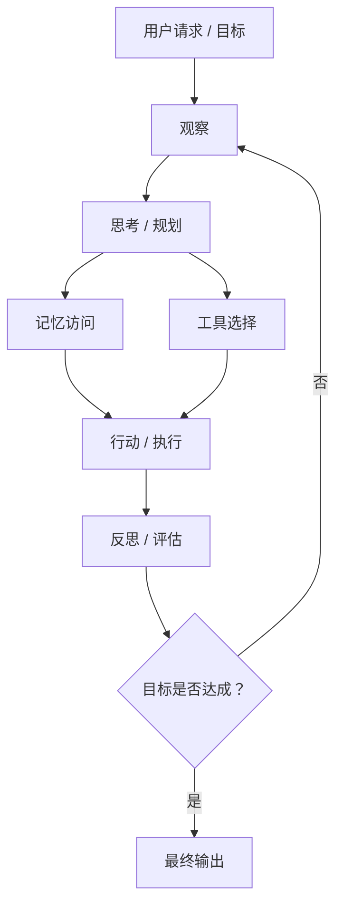

import SupportCTA from "/snippets/support-cta-zh-Hans.mdx";

<SupportCTA />

## 摘要

智能体是一种以目标为导向的系统，能够持续感知环境、做出决策，并采取行动以实现期望结果。它不是一个静态模型，而是作为一个持续运行的循环工作：在动态周期中观察、推理和行动，并适应变化的条件。本节会帮助你理解智能体与独立模型的区别，理解这种感知-决策-行动循环如何构成智能行为的核心，以及这类系统如何在真实场景中被设计和应用。

## 为什么这很重要

传统程序和独立模型天然受限：它们执行预定义逻辑，或产生一次性输出，却无法长期适应、保持状态或追求目标。智能体之所以重要，是因为它们把静态计算转变为**持续的、以目标为驱动的行为**。

自主性减少了对持续人工干预的需求，让系统可以在动态环境中独立运行。工具使用把能力扩展到单个模型之外，使系统能够与外部系统、数据源和现实动作交互。最重要的是，智能体的循环本质，即持续观察、推理和行动，使它能够处理无法通过单次响应解决的复杂多步骤任务。

本质上，智能体代表了一种从“执行”到“行为”的转变：从只响应一次的系统，走向能够**行动、适应并随时间改进**的系统。理解这种转变，是构建实用、可扩展并能贴合现实复杂性的智能系统的关键。

## 心智模型

智能体的核心是一个**闭环决策系统**，而不是一次性计算。智能体不是简单的线性流水线，而是通过持续循环运行：

**Observe → Think → Act → Reflect → Loop**

* **Observe**：智能体通过用户查询、传感器数据或外部信号等输入感知环境。
* **Think**：它使用模型（例如 LLM）、规则或规划策略，对观察到的信息进行推理，并决定下一步做什么。
* **Act**：智能体执行动作，例如调用工具、生成输出或与环境交互。
* **Reflect**：它评估行动结果，把反馈、错误或新信息纳入后续行为调整。

这个循环随后重复，形成一个**自我修正且自适应的循环**。

关键在于，智能体并不是由某一次决策或响应定义的，而是由这个持续过程定义的。它的智能来自随着时间迭代改进行动的能力。换句话说，智能体从根本上是一个**持续运行的闭环系统**，而不是一次函数调用。

---

### 示例：每日新闻观察者

设想一个用于生成新闻摘要的每日新闻观察者智能体：

* **Observe**：智能体接收请求（例如“总结最新 AI 新闻”），并从一组来源抓取文章。
* **Think**：它决定哪些文章相关，按主题筛选，并决定如何组织内容。
* **Act**：它检索、解析并总结选中的文章，形成结构化报告。
* **Reflect**：它评估结果是否完整且连贯，并在必要时调整。

这个过程形成一个循环，让智能体能够根据中间结果持续优化输出。

---

### 这与传统脚本有何不同

虽然这个工作流看起来可能类似脚本化流水线，但智能体的行为有根本不同：

* **动态决策**
  传统脚本遵循固定步骤序列。
  智能体会根据中间结果决定每一步做什么（例如保留哪些文章、如何总结它们）。

* **上下文感知推理**
  脚本依赖预定义规则。
  智能体解释输入（例如“最新 AI 新闻”），并据此调整行为。

* **灵活控制流**
  脚本的控制流是静态的。
  智能体可以根据结果循环、修正或分支（例如结果不足时重新抓取或重新总结）。

* **语言智能集成**
  脚本以确定性方式处理结构化数据。
  智能体使用模型处理文本等非结构化数据，从而支持总结、筛选和推理。

## 架构图

## 工具生态

现代智能体不是作为单一模型构建的，而是把推理、行动和记忆组合为一个整体的多组件系统。这种模块化设计让智能体能够超越简单响应，处理复杂的真实任务。

* **LLM（推理核心）**：通过解释输入并生成计划来决定要做什么。
* **工具（行动层）**：通过与外部系统交互并执行动作来扩展能力。
* **记忆（上下文层）**：提供跨步骤连续性，支持上下文保留和适应。
* **框架（编排层）**：把组件组织和协调为可运行的系统（例如 LangChain、AutoGen）。

一个有用的心智模型是：把 LLM 看作“大脑”，把工具看作“四肢”。延伸这个类比，后端系统就像神经系统：它并不执行生物意义上的信号传递，而是解析模型输出，将其映射为结构化函数调用，并通过程序逻辑路由来触发工具执行。正是这一层完成了从决策到行动的转变，把抽象推理转化为具体操作。

本质上，现代智能体不只是一个模型，而是一个协调起来的组件系统。智能来自推理、工具、记忆和控制逻辑之间的交互。

## 取舍

虽然智能体释放了强大能力，但这些特性也带来重要取舍。

* **循环成本（延迟 / token / 复杂度）**：
  持续的观察-思考-行动循环会引入额外延迟和更高 token 使用量。多步骤推理、重试和反思会增加系统复杂度，让性能优化和成本控制更具挑战。

* **自主性风险（错误或非预期行动）**：
  更高自主性意味着智能体可以在没有持续人工监督的情况下行动，但这也会引入错误决策、不安全动作或误解目标的风险，尤其是在开放环境中。

* **工具依赖（系统可靠性）**：
  智能体依赖外部工具和 API 来行动。这些依赖的失败，例如 API 错误、延迟尖峰或不一致输出，会直接影响智能体行为和整体系统稳定性。

本质上，让智能体强大的同一组属性，即循环、自主性和工具使用，也会引入必须在真实系统中谨慎管理的**成本、风险和工程挑战**。

## 引用

- Wooldridge, M., & Jennings, N. R. (1995). Intelligent Agents: Theory and Practice
- Xi, Z., Chen, W., Guo, X., et al. (2023). The Rise and Potential of Large Language Model Based Agents

## 延伸阅读

- 下一篇：[第 1.3 章 智能体系统是什么？](/zh-Hans/foundations/agent-systems/what-is-agent-system)
- [智能体与工作流](/zh-Hans/foundations/agents-vs-workflows)
- [智能体记忆与检索](/zh-Hans/patterns/agent-memory-and-retrieval)
- [基础概览](/zh-Hans/foundations)

## 更新日志

- 2026-04-20：初始脚手架。
- 2026-05-04：完成核心内容，包括定义、心智模型、工具生态、取舍、示例和引用。
