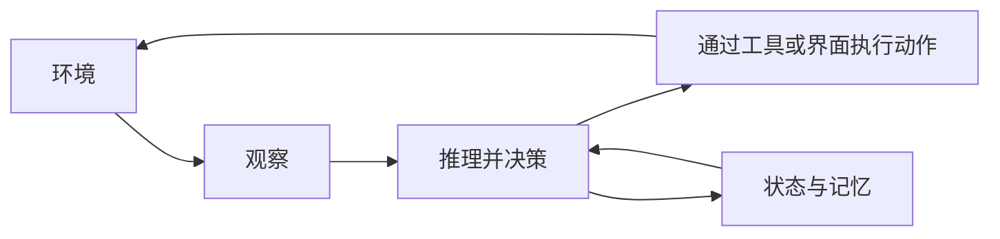

import SupportCTA from "/snippets/support-cta-zh-Hans.mdx";

<SupportCTA />

## 摘要

智能体系统是一种以目标为导向的软件系统。它能够观察不断变化的环境，决定下一步做什么，并通过工具或界面执行动作，同时在多个步骤之间携带状态。

## 为什么这很重要

“智能体”这个词很容易被过度使用。现在许多系统只要有聊天框或 LLM，就会贴上这个标签。除非我们描述清楚软件具备智能体特征时到底发生了什么变化，否则这个分类会变得不再有用。

真正重要的转变并不是系统能够生成文本，而是系统能够管理一个行动循环：

- 感知当前状态
- 选择或修正计划
- 对外部世界采取行动
- 观察结果
- 持续进行，直到达到停止条件

## 心智模型

一个稳定的定义包含四个部分：

- `environment`：系统运行其中的那部分世界
- `perception`：系统如何了解这个环境
- `action`：系统如何改变或查询这个环境
- `autonomy`：系统在感知和行动之间承担多少决策

现代智能体系统不同于早期自动化，因为大语言模型让系统更容易处理模糊指令、选择工具、改写计划，并在环境变化时适应。

但这并不意味着每个 LLM 应用都是智能体系统。只有当软件具备以下特征时，这个类别才最有意义：

- 明确的任务或目标
- 一个循环，而不是一次响应
- 可以访问工具、API、文件或其他外部表面
- 跨步骤重要的记忆或状态

## 架构图

## 工具生态

在实践中，智能体系统可以呈现为几种形态：

- 嵌入在开发者工具或工作工具中的助手
- 追求委派目标的自主工作者
- 多智能体系统中的专门智能体
- 围绕证据和工具反复迭代的研究、编码或运维系统

在这些形态中，核心设计问题不是“它说话像不像智能体？”而是“它是否管理着一个真实的感知-决策-行动循环？”

## 取舍

- 更高的自主性可以减少人工工作量，但也会增加监控和故障处理需求。
- 更丰富的环境会让智能体更有用，但也会让它们更不可预测。
- 更强的工具访问能力扩展了能力，但也带来安全与策略问题。
- 更多状态可以改善连续性，但会让错误假设停留更久。

因此，良好的系统设计应从明确边界开始：

- 智能体能感知什么
- 它能做什么
- 它需要独立负责决定什么
- 什么时候必须由人介入

## 引用

- 来源输入：[第 1.1 章 智能体系统导论](/zh-Hans/foundations/agent-systems/why-agent-systems-matter)

## 延伸阅读

- 下一篇：[第 1.1 章 为什么智能体系统很重要](/zh-Hans/foundations/agent-systems/why-agent-systems-matter)
- [智能体与工作流](/zh-Hans/foundations/agents-vs-workflows)
- [智能体记忆与检索](/zh-Hans/patterns/agent-memory-and-retrieval)
- [基础概览](/zh-Hans/foundations)

## 更新日志

- 2026-04-21：基于导入的参考材料和实验室重写规则，完成初始的仓库原生草稿。
