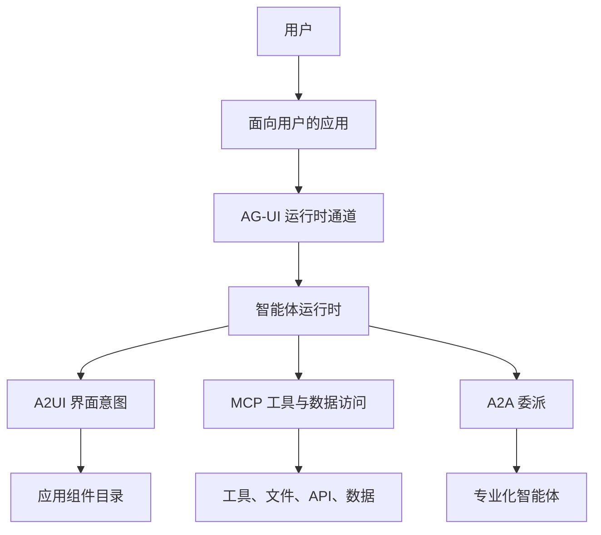

import SupportCTA from "/snippets/support-cta-zh-Hans.mdx";

<SupportCTA />

## 摘要

面向用户的智能体除了工具契约和智能体间契约之外，还需要自己的界面契约。
`AG-UI` 定义了智能体后端与应用之间的事件驱动运行时连接。`A2UI`
定义了智能体如何针对既有组件目录声明可移植的 UI 意图。

实际要点很简单：不要把界面交互硬塞进 `MCP` 或 `A2A`。应把面向用户的
表面视为一个独立的系统边界。

## 重要性

对于很多智能体产品来说，聊天框只是一个较弱的默认形态。真正的应用通常需
要：

- 在长任务运行时持续流式反馈状态
- 类型化的前端动作与人工批准
- 应用与智能体之间的共享状态
- 仍然由应用控制的组件、表单、图表或编辑器

这和工具访问或智能体委派是不同的问题。

如果团队跳过这一区分，通常会出现两种糟糕结果：

- 把本来不是为 UI 设计的工具协议硬塞入界面关注点
- 前端累积出一堆临时事件连线，最终很难调试

## 心智模型

当前信号比这更清晰：

- `AG-UI`：面向用户应用与智能体后端之间的运行时交互层
- `A2UI`：面向可移植生成式组件的 UI 意图层
- `MCP`：工具与数据访问层
- `A2A`：智能体间委派层

这些层可以协同工作，而不必坍塌成单一协议。

| 如果问题是... | 从...开始 | 因为... |
| --- | --- | --- |
| 应用如何与智能体双向传输消息、工具事件、批准与共享状态？ | AG-UI | 边界是实时应用运行时行为。 |
| 智能体如何提出一个可移植的组件或界面形态？ | A2UI | 边界是针对应用控制的组件目录表达 UI 意图。 |
| 智能体如何调用工具或读取外部资源？ | MCP | 边界在于能力访问。 |
| 一个智能体如何把工作交给另一个类智能体服务？ | A2A | 边界在于委派与协作。 |

有用的默认做法：

- 当产品把智能体嵌入应用内部时，使用 `AG-UI`
- 当跨客户端或跨团队的可移植组件声明很重要时，再加上 `A2UI`
- 让 `MCP` 与 `A2A` 保持在各自边界内

## 架构图

应用仍然拥有最终渲染体验。智能体负责提出、流式传递或协调，应用负责验证、
挂载并治理用户最终看到的内容。

## 工具体系

当交互本身是有状态且事件密集的，AG-UI 就很有用：

- token 或事件流
- 需要进度反馈的长任务
- 前端工具调用或人工批准
- 共享应用状态
- 人在回路中的中断

当智能体需要以可移植方式描述 UI，而不是硬编码某个单一前端实现时，A2UI
就很有用。

这并不意味着每个智能体产品都需要两者：

- 当稳定工作流只需要少数已知状态时，优先用应用自有组件
- 当智能体必须持续连接到真实产品界面时，使用 AG-UI
- 只有当声明式、可移植 UI 意图确实带来杠杆时，才加入 A2UI

设计目标应是“受控的灵活性”，而不是“无限制的界面生成”。

## 取舍

- 更强的界面协议能让产品更像原生应用，但也会增加验证与治理工作。
- 运行时通道能改善可追踪性，但也会引入事件 schema 与生命周期处理，而这些是简单请求-响应应用可以避免的。
- 可移植 UI 意图可以减少重复的前端连线，但前提是组件目录本身保持纪律性。
- 如果智能体可以过于自由地修改界面，调试性与信任度往往会下降而不是上升。

强默认：

- 保持由应用控制最终渲染组件
- 在挂载前验证智能体提出的 UI
- 把界面状态与工具权限分开
- 把人工批准视为一等事件，而不是特殊补丁

## 引用

- 官方来源：[A2UI v0.9: The New Standard for Portable, Framework-Agnostic Generative UI](https://developers.googleblog.com/a2ui-v0-9-generative-ui/)
- 官方来源：[AG-UI Overview](https://docs.ag-ui.com/introduction)
- 官方来源：[AG-UI Protocol](https://www.copilotkit.ai/ag-ui)
- 高信号仓库：[ag-ui-protocol/ag-ui](https://github.com/ag-ui-protocol/ag-ui)
- 高信号仓库：[CopilotKit/CopilotKit](https://github.com/CopilotKit/CopilotKit)

## 延伸阅读

- [协议与互操作](/zh-Hans/systems/protocols-and-interoperability)
- [评估与可观测性](/zh-Hans/systems/evaluation-and-observability)
- [系统概览](/zh-Hans/systems)

## 更新日志

- 2026-05-06：新增一个仓库原生的系统页面，用来解释 AG-UI、A2UI 以及
  智能体到界面的边界。
